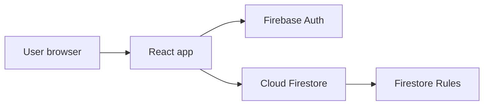
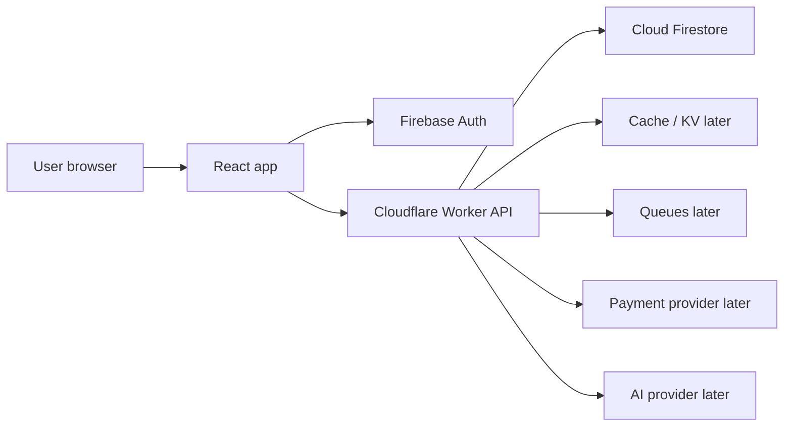
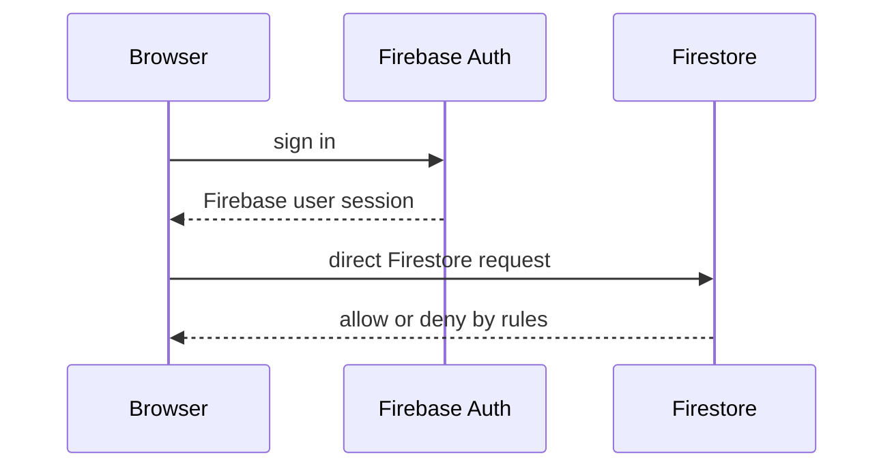
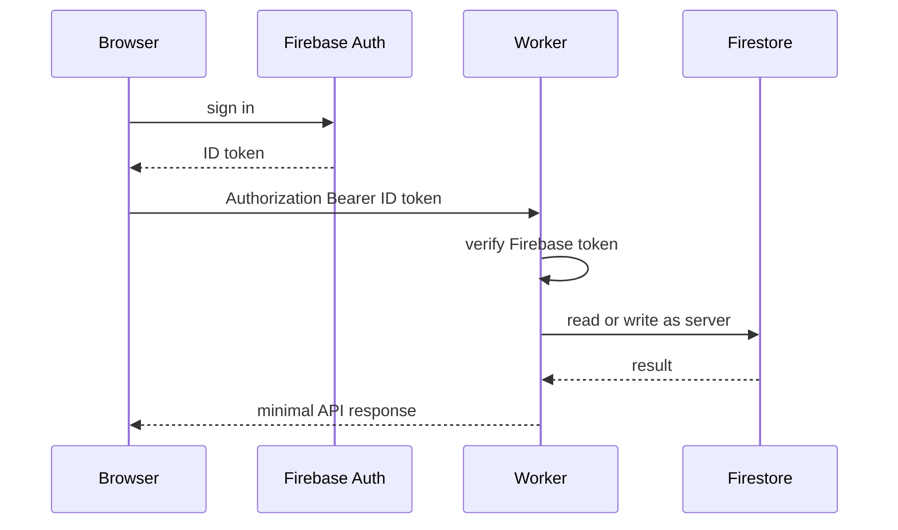

# Breaking Ice System Architecture

This document is the working source of truth for the Breaking Ice backend migration.

It describes the app as it exists today, the Worker-backed target shape, and the order we will move features. If future work disagrees with this file, update this file first so the decision is explicit.

## Product

Breaking Ice is a conversation assistant for awkward real-life moments. The user should quickly get one usable line, browse more lines when they want, share a line, and manage their own profile.

Primary user flows, in usage order:

1. `live`
2. `explore`
3. `top picks`
4. `share`
5. `profile`

Secondary flows:

- login
- submit a line
- vote
- admin moderation
- payments later
- queues later
- AI moderation later
- ads later

## Current System

Today the main frontend talks directly to Firebase.



Current behavior:

- login happens in the frontend through Firebase Auth
- the frontend reads and writes Firestore directly
- Firestore Rules decide what is allowed
- there is no custom backend API yet
- this Worker repo is the start of the backend layer

## Target System

Firebase Auth stays. Cloudflare Workers become the backend API layer for moved features.



Target behavior:

- frontend still uses Firebase Auth for login
- public read APIs move to Worker first
- protected APIs send Firebase ID tokens to Worker
- Worker verifies tokens before protected actions
- Firestore remains the source of truth during migration
- secrets live only in Worker environment/secrets

## Auth Model

Firebase Auth is not being replaced.

### Login Now



### Protected Worker API Later



Rules:

- do not move login first
- do not build custom password auth
- do not trust `uid` sent in JSON
- only trust `uid` decoded from a verified Firebase ID token
- token verification happens inside Worker for protected routes

## Feature Map

| Feature | Current path | Future path | Auth needed | Move order |
| --- | --- | --- | --- | --- |
| health | none | Worker | no | 0 |
| live | frontend -> Firestore | frontend -> Worker -> Firestore/cache | optional at first | 1 |
| explore | frontend -> Firestore | frontend -> Worker -> Firestore/cache | no | 2 |
| top picks | frontend -> Firestore | frontend -> Worker -> Firestore/cache | no | 3 |
| share | frontend route/share metadata | mostly frontend, optional Worker helper | no | 4 |
| public profile | frontend -> Firestore | frontend -> Worker -> Firestore/cache | no | 5 |
| private profile | frontend -> Firestore | frontend -> Worker -> Firestore | yes | later |
| submit line | frontend -> Firestore | frontend -> Worker -> Firestore | yes | later |
| vote | frontend -> Firestore transaction | frontend -> Worker -> Firestore transaction | yes | later |
| admin | frontend -> Firestore | frontend -> Worker -> Firestore | admin | later |
| payments | not built | frontend -> Worker -> provider | yes | much later |
| queues | not built | Worker producer/consumer | server only | much later |
| AI | not built | Worker -> AI provider | admin/server | much later |
| ads | not built | Worker-assisted feed placement later | no/optional | later |

## API Vision

These are expected API contracts. They are not all being built now.

### Health

`GET /health`

Purpose:

- prove the Worker is alive
- prove deployment works

Response:

```json
{
  "ok": true,
  "service": "icebreaker-workers",
  "environment": "development"
}
```

### Live

`GET /api/live-prompt?pack=playful&situation=date`

Purpose:

- return one ready-to-show prompt for live mode

Request fields:

- `pack`
- `situation`

Response:

```json
{
  "ok": true,
  "prompt": {
    "id": "line-id",
    "text": "What is something small that always makes your day better?",
    "pack": "playful",
    "situation": "date"
  }
}
```

Fallback order:

1. approved lines matching `pack` and `situation`
2. approved lines matching `pack` and `situation=any`
3. approved legacy lines that can still fit the selected filters

Do not add personalization yet. The frontend can keep local seen-state at first.

### Explore

`GET /api/explore?category=curious&cursor=...`

Purpose:

- return approved non-promoted lines for browsing

Response shape:

```json
{
  "ok": true,
  "lines": [],
  "nextCursor": "cursor-or-null"
}
```

Notes:

- first implementation can mirror existing Firestore ordering
- cache can come later
- ads can be inserted later after this route owns the feed

### Top Picks

`GET /api/top-picks?cursor=...`

Purpose:

- return promoted lines

Response shape:

```json
{
  "ok": true,
  "lines": [],
  "nextCursor": "cursor-or-null"
}
```

### Share

Share is mostly frontend-owned right now.

Future optional route:

`GET /api/lines/:id/share`

Purpose:

- return a minimal public line payload for share pages
- keep private author/user data out

### Profile

Public profile route:

`GET /api/profiles/:uid/lines`

Purpose:

- return approved public lines for a profile page

Private profile route later:

`GET /api/me/lines`

Purpose:

- return the signed-in user's own submitted lines
- requires verified Firebase token

### Submit

`POST /api/lines/submit`

Purpose:

- create a pending line through Worker instead of direct Firestore write

Auth:

- verified Firebase token required
- ban check required

Body:

```json
{
  "text": "line text",
  "category": "curious",
  "pack": "deep",
  "situation": "date"
}
```

Server responsibilities:

- validate text
- normalize/fingerprint text
- check ban state
- write pending line
- later enqueue moderation work

### Vote

`POST /api/votes`

Purpose:

- upvote or remove upvote on a line

Auth:

- verified Firebase token required

Body:

```json
{
  "lineId": "line-id"
}
```

Server responsibilities:

- verify line is voteable
- update vote doc
- update aggregate counts safely
- apply promotion threshold

### Admin

Admin routes require:

- verified Firebase token
- admin role check

Expected routes:

- `GET /api/admin/review-lines`
- `POST /api/admin/lines/:id/moderate`
- `PATCH /api/admin/lines/:id/live-metadata`
- `POST /api/admin/users/:uid/ban`
- `DELETE /api/admin/users/:uid/ban`

AI is not part of admin v1. Manual admin workflows come first.

### Payments

Payments are not part of the first Worker migration.

Future routes:

- `POST /api/payments/create-session`
- `POST /api/payments/webhook`

Rules:

- payment secrets only in Worker
- webhook verification in Worker
- no payment provider secret in frontend

### Queues

Queues are not part of the first Worker migration.

Future use:

- moderation jobs
- analytics rollups
- delayed cleanup
- email or notification jobs if added

### AI

AI is not being added until core Worker paths are stable.

Future use:

- suggest admin moderation decision
- never auto-approve at first
- admin keeps final control

### Ads

Ads are not being added until Worker owns feed APIs.

Future use:

- inject sponsored/top-pick cards into explore feed
- keep line payload and ad payload clearly separated
- no ads inside live prompt v1

## Migration Plan

### Phase 0: Worker Foundation

Status: started.

Includes:

- Worker repo
- TypeScript
- Wrangler
- CI
- deploy dry run
- `/health`

### Phase 1: Live API

Build:

- `GET /api/live-prompt`
- validation for `pack` and `situation`
- one test for success
- one test for invalid params
- frontend integration later

Keep:

- Firebase Auth unchanged
- live UI unchanged
- Firestore as data source

### Phase 2: Explore and Top Picks

Build:

- `GET /api/explore`
- `GET /api/top-picks`
- cursor pagination
- minimal line payloads

Add cache only after the route works.

### Phase 3: Public Profile and Share

Build:

- `GET /api/profiles/:uid/lines`
- optional `GET /api/lines/:id/share`

Return public data only.

### Phase 4: Protected User Writes

Build:

- Firebase ID token verification
- `POST /api/lines/submit`
- `POST /api/votes`

Keep Firestore rules strict while rolling out.

### Phase 5: Admin

Build:

- admin token verification
- role check
- review list
- moderation actions
- ban/unban actions

No AI in this phase unless manually requested later.

### Phase 6: Payments, Queues, AI, Ads

Build only after the real product path needs them.

Expected order:

1. payments
2. queues
3. ads in feeds
4. AI moderation helper

## Data Model Direction

Firestore remains the source of truth during migration.

Primary collections from current app:

- `lines`
- `lines/{lineId}/votes`
- `roles`
- `bannedUsers`
- `userProfiles`

Worker should return smaller payloads than Firestore documents. Do not leak internal fields unless the frontend needs them.

## Security Baseline

Required:

- validate every request in Worker
- verify Firebase ID tokens on protected routes
- re-check admin role server-side for admin routes
- re-check ban state server-side for submit/vote routes
- keep secrets in Worker secrets/env only
- keep Firestore rules strict during migration
- return minimal data
- log sensitive actions later: moderation, ban, payment

Not acceptable:

- trusting frontend `uid`
- exposing Firebase Admin or payment secrets
- moving login before read APIs
- adding AI moderation before manual flows are stable
- building a huge router/framework before endpoints exist

## Ownership

Frontend owns:

- UI
- Firebase Auth login UX
- client-side route navigation
- local UI state
- calling Worker APIs

Worker owns:

- API contracts
- server validation
- token verification
- server-only integrations
- read models and feed assembly
- future queue producers/consumers

Firestore owns:

- persistent app data
- current access control
- source of truth during migration

## Decision Log

1. Firebase Auth stays.
2. Worker migration starts with read-heavy user flows.
3. Login is not moved first.
4. AI is not part of first backend work.
5. Admin is not first because current usage priority is `live`, then explore/top picks.
6. The first real backend API is `GET /api/live-prompt`.
